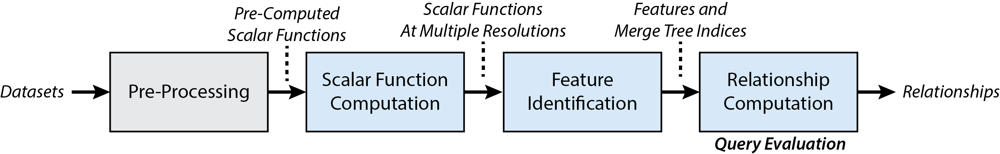
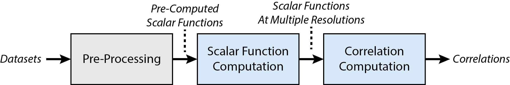

# Data Polygamy

Data Polygamy is a scalable topology-based framework that allows users to query for statistically significant relationships between spatio-temporal datasets. For more detailed information about the our framework, please refer to our SIGMOD paper:

*Data Polygamy: The Many-Many Relationships among Urban Spatio-Temporal Data Sets, F. Chirigati, H. Doraiswamy, T. Damoulas, and J. Freire. In Proceedings of the 2016 ACM SIGMOD International Conference on Management of Data (SIGMOD), 2016*

We strongly suggest users to read our paper before using our code.

The team includes:

* [Fernando Chirigati][fc] (New York University)
* [Harish Doraiswamy][hd] (New York University)
* [Theodoros Damoulas][td] (University of Warwick)
* [Juliana Freire][jf] (New York University)

[fc]: http://bigdata.poly.edu/~fchirigati/
[hd]: http://www.harishd.com/
[td]: http://www2.warwick.ac.uk/fac/sci/statistics/staff/academic-research/damoulas
[jf]: http://vgc.poly.edu/~juliana/

Our code and data in this repository are available under the [BSD](LICENSE) license.

## Contents

This README file is divided into the following sections:

* [1. Repository Overview](#1-repository-overview)
* [2. Dependencies](#2-dependencies)
* [3. Preliminaries](#3-preliminaries)
    * [3.1. HDFS Directory](#31-hdfs-directory)
    * [3.2. Spatial Resolutions](#32-spatial-resolutions)
    * [3.3. Data](#33-data)
* [4. How To Build](#4-how-to-build)
* [5. How To Run](#5-how-to-run)
    * [5.1. Common Arguments](#51-common-arguments)
    * [5.2. Pre-Processing Step](#52-pre-processing-step)
    * [5.3. Step 1: Scalar Function Computation](#53-step-1-scalar-function-computation)
    * [5.4. Step 2: Feature Identification](#54-step-2-feature-identification)
    * [5.5. Step 3: Relationship Computation (Query Evaluation)](#55-step-3-relationship-computation-query-evaluation)
    * [5.6. Alternate Step: Correlation Computation](#56-alternate-step-correlation-computation)
* [6. Experiments](#6-paper-experiments)
    * [6.1. Machine Configuration](#61-machine-configuration)
    * [6.2. Datasets](#62-datasets)
    * [6.3. Initial Setup](#63-initial-setup)
    * [6.4. Performance Evaluation](#64-performance-evaluation)
    * [6.5. Correctness and Robustness](#65-correctness-and-robustness)
    * [6.6. Standard Techniques](#66-standard-techniques)

## 1. Repository Overview

Soon ...

## 2. Dependencies

The Data Polygamy framework uses Java 1.7.0_45 and has the following dependencies:

* [Apache Commons Lang 2.6](http://commons.apache.org/proper/commons-lang/)
* [Apache Commons CLI 1.2](http://commons.apache.org/proper/commons-cli/)
* [Apache Commons Collections 3.2.1](http://commons.apache.org/proper/commons-collections/)
* [Apache Commons CSV 1.0](http://commons.apache.org/proper/commons-csv/)
* [Apache Commons Logging 1.2](http://commons.apache.org/proper/commons-logging/)
* [Apache Commons Math 3.3](https://commons.apache.org/proper/commons-math/)
* [fastutil 6.6.5](http://fastutil.di.unimi.it/)
* [Guava 18.0](https://github.com/google/guava)
* [Apache Hadoop Annotations 2.4.0](http://mvnrepository.com/artifact/org.apache.hadoop/hadoop-annotations/2.4.0)
* [Apache Hadoop Common 2.4.0](http://mvnrepository.com/artifact/org.apache.hadoop/hadoop-common/2.4.0)
* [Hadoop Mapreduce Client Core 2.4.0](http://mvnrepository.com/artifact/org.apache.hadoop/hadoop-mapreduce-client-core)
* [Joda-Time 2.5](http://www.joda.org/joda-time/)
* [JIDT 1.3](http://jlizier.github.io/jidt/)
* [Java-ML 0.1.7](http://java-ml.sourceforge.net/)
* [JavaMI 1.0](http://www.cs.man.ac.uk/~pococka4/JavaMI.html)

## 3. Preliminaries

This section describes information about the data used by the framework that *must* be in place before executing the framework.

### 3.1. HDFS Directory

The code originally reads from and writes to HDFS. It assumes that the HDFS home directory has the following structure:

    .
    +-- data/
    |   +-- datasets
    |   +-- dataset
    |   +-- dataset.header
    |   +-- dataset.defaults
    |   +-- ...
    +-- pre-processing/
    |   +-- ...
    +-- aggregates/
    |   +-- ...
    +-- index/
    |   +-- ...
    +-- mergetree/
    |   +-- ...
    +-- relationships/
    |   +-- ...
    +-- relationships-ids/
    |   +-- ...
    +-- correlations/
    |   +-- ...
    +-- neighborhood
    +-- neighborhood-graph
    +-- zipcode
    +-- zipcode-graph

where:

* **``data``** is a directory containing all the datasets and metadata associated with the datasets (more information [later](#33-data));
* **``pre-processing/``** is a directory that stores the results from the [pre-processing step](#52-pre-processing-step);
* **``aggregates/``** is a directory that stores the results from the [scalar function computation step](#53-step-1-scalar-function-computation);
* **``index/``** is a directory that stores the results from the [feature identification step](#54-step-2-feature-identification);
* **``mergetree/``** is a directory that stores the previously computed merge trees;
* **``relationships/``** is a directory that stores the results from the [relationship computation step](#55-step-3-relationship-computation-query-evaluation), i.e., the topology-based relationships between datasets;
* **``relationships-ids/``** is a directory similar to ``relationships/``, but the relationships are stored with the datasets ids, instead of the datasets names;
* **``correlations/``** is a directory that stores the results from the standard correlation techniques step;
* **``neighborhood``** and **``zipcode``** are files that contain the polygons corresponding to the neighborhood and zipcode resolutions, respectively (more information [later](#32-spatial-resolutions));
* **``neighborhood-graph``** and **``zipcode-graph``** are files that contain the graph structure of the neighborhood and zipcode resolutions, respectively (more information [later](#32-spatial-resolutions)).

To automatically create the required directories, take a look at the [``load-hdfs-structure``](data/load-hdfs-structure) script.

### 3.2. Spatial Resolutions

The current implementation of Data Polygamy has support to five spatial resolutions: *GPS*, *neighborhood*, *zipcode*, *grid*, and *city*. The grid resolution has only been used for testing, and not in our final experiments. Note that the framework assumes that all the data fed to the pre-processing step corresponds to a single city; therefore, if you are handling data from more than one city, you probably need to provide a suitable resolution conversion under the [``resolution``](data-polygamy/src/main/java/edu/nyu/vida/data_polygamy/resolution/) directory.

To use the neighborhood and zipcode resolutions, two files must be provided for each: a **polygons** file, and a **graph** file. The former contains all the polygons that represent the different regions of the resolution (e.g.: neighborhoods or zipcodes) with their corresponding ids. A polygon, in this case, is represented by a set of GPS points, where the last point is the same as the first one. The format is the following:

    <region-id>              # first region
    <number-of-polygons>
    <number-of-data-points>  # first polygon
    <point-1>
    <point-2>
    ...    
    <number-of-data-points>  # second polygon
    ...
    <region-id>              # second region
    ...

The files [``neighborhood.txt``](data/neighborhood.txt) and [``zipcode.txt``](data/zipcode.txt) are examples of such file for New York City.

The **graph** file represents a graph for the resolution, where each region of the resolution is a node, and there is an edge between two regions if these are neighboring regions. The first line of this file contains the number of nodes and number of edges, and the following lines represent the edges of the graph (one line per edge). The files [``neighborhood-graph.txt``](data/neighborhood-graph.txt) and [``zipcode-graph.txt``](data/zipcode-graph.txt) are examples of such file for New York City.

The script [``load-spatial``](data/load-spatial) can be used to automatically upload our spatial resolutions files to HDFS. 

### 3.3. Data

The ``data`` directory under HDFS contains all the datasets used by the framework.

#### Dataset Attributes

We assume the following types of attributes for a dataset:

* **Spatial attributes** represent the spatial component of the data (e.g.: a GPS point, or a neighborhood region).
* **Temporal attributes** represent the temporal component of the data (e.g.: a GPS point, or a neighborhood region). Such attribute *must* have values that represent the number of seconds since Epoch time, in UTC.
* **Identifier attributes** represent unique identifiers for the dataset (e.g.: Twitter user id, or taxi medallion). The header for these attributes *must* contain either *id*, *name*, or *key*.
* **Numerical attributes** represent the real-valued attributes of the datasets, which are the attributes of interest for the relationships.

All the other attributes can be ignored by enclosing their values by either double quotes (e.g.: ``"ignore me!"``) or the symbol `$` (e.g.: ``$ignore me!$``). Alternatively, you can also simply delete these attributes before executing the framework.

#### Dataset Files

For each dataset, three files are required and must be located under the ``data`` directory. For the purpose of this documentation, assume a dataset named *taxi*:

* **``taxi``**: a CSV file containing the data corresponding to the dataset (without any headers).
* **``taxi.header``**: a CSV file containing a single line, which is the header of the dataset.
* **``taxi.defaults``**: a CSV file with a single line containing the default values for each attribute of the dataset. If an attribute does not have a default value, ``NONE`` should be used. Note that default values are *ignored* by the framework.

In addition to these dataset files, a file named ``datasets`` must be created under the ``data`` directory, containing a mapping between dataset name and dataset id. An example of such file is available [here](data/datasets.txt).

## 4. How To Build

We use [Apache Maven](https://maven.apache.org/) 3.3.9 to build the Data Polygamy framework:

    $ cd data-polygamy/
    $ mvn clean package

This generates a jar file, with the following name and path: ``data-polygamy/target/data-polygamy-0.1-jar-with-dependencies.jar``. For simplicity, we refer to this file as ``data-polygamy.jar`` throughout this documentation. 

Note that all the dependencies are taken care of by Maven, except for [JIDT](http://jlizier.github.io/jidt/), [Java-ML](http://java-ml.sourceforge.net/), and [JavaMI](http://www.cs.man.ac.uk/~pococka4/JavaMI.html), since these libraries are not available in the central repository. Therefore, we include these libraries, as well as their corresponding licenses, under [``data-polygamy/lib``](data-polygamy/lib). It is worth mentioning that we **did not** make modifications to any of these libraries.

## 5. How To Run

To run our framework, you will need [Apache Hadoop](http://hadoop.apache.org/). The framework can be summarized as follows:

Each step of the framework is represented by a map-reduce job. The Pre-Processing step is executed once for each dataset, while the other steps can be executed once for multiple datasets.

### 5.1. Common Arguments

The following command-line arguments are available in all the steps of the framework:

*Required Arguments*:

* **``-m``**: identifier for the machine configuration of the Hadoop cluster nodes. These identifiers are defined in the class Machine in file [FrameworkUtils.java](data-polygamy/src/main/java/edu/nyu/vida/data_polygamy/utils/FrameworkUtils.java). For each identifier, information related to the corresponding machine is declared (e.g.: number of cores, amount of memory, and number of disks). Such information is used to set a few Hadoop configuration parameters.
* **``-n``**: number of nodes in the Hadoop cluster.

*Optional Arguments*:

* **``-f``**: flag that forces the execution of the step for all the input datasets, even if the results for these datasets already exist. In other words, existing results or output files are deleted and the step is re-executed for all input datasets. The [pre-processing step](#52-pre-processing-step) is the only step that does not support this argument (existing files are automatically removed).
* **``-s3``**: flag that indicates that the execution will read data from and write data to a bucket on [Amazon S3](https://aws.amazon.com/s3/) storage service.
* **``-aws_id``**: the AWS Access Key Id. This argument is required if the ``s3`` flag is used.
* **``-aws_key``**: the AWS Secret Access Key. This argument is required if the ``s3`` flag is used.
* **``-b``**: the bucket on S3 where data will be read from and write to. This argument is required if the ``s3`` flag is used.
* **``-h``**: flag that displays a help message.

### 5.2. Pre-Processing Step

The Pre-Processing step is responsible for selecting data (from a dataset) that correspond to spatial, temporal, identifier, and numerical [attributes](#dataset-attributes). This step also does a pre-aggregation that is fed to the scalar function computation step.

To run the pre-processing step:

    $ hadoop jar data-polygamy.jar edu.nyu.vida.data_polygamy.pre_processing.PreProcessing -m <machine> -n <number-nodes> -dn <dataset name> -dh <dataset header file> -dd <dataset defaults file> -t <temporal resolution> -s <spatial resolution> -cs <current spatial resolution> -i <temporal index> <spatial indices> ...
    
where:

* **``-dn``** indicates the dataset name, which should match the dataset file under the ``data`` directory.
* **``-dh``** indicates the dataset header file, located under the ``data`` directory.
* **``-dd``** indicates the dataset defaults file, located under the ``data`` directory.
* **``-t``** indicates the minimum temporal resolution that this data should be aggregated. This can take the following values: *hour*, *day*, *week*, or *month*. We recommend setting this to *hour*.
* **``-cs``** indicates the current spatial resolution of the data, i.e., *points* (for GPS points), *nbhd* (for neighborhood), *zip* (for zipcode), or *city*.
* **``-s``** indicates the minimum spatial resolution that this data should be aggregated. For instance, if the current spatial resolution is *points*, the minimum spatial resolution could be *nbhd* or *zip*.
* **``-i``** indicates the indices for the temporal and spatial attributes. For instance, if the temporal attribute is on index 0, and the x and y components of the spatial attribute is on indices 2 and 3, this should be set as ``-i 0 2 3``.

The results are stored under the ``pre-processing`` directory.

### 5.3. Step 1: Scalar Function Computation

The Scalar Function Computation step is responsible for generating all possible scalar functions at different spatio-temporal resolutions.

To run the scalar function computation step:

    $ hadoop jar data-polygamy.jar edu.nyu.vida.data_polygamy.scalar_function_computation.Aggregation -m <machine> -n <number-nodes> -g <datasets>
    
where:

* **``-g``** indicates the datasets for which the scalar functions will be computed, followed by the temporal and spatial indices. For instance, to execute this step for the taxi and 311 datasets, one can use ``-g taxi 0 0 311 0 0``.

The results are stored under the ``aggregates`` directory.

### 5.4. Step 2: Feature Identification

The Feature Identification step creates the merge tree indices (if they have not been created yet) and identifies the set of features for the different scalar functions.

To run the feature identification step:

    $ hadoop jar data-polygamy.jar edu.nyu.vida.data_polygamy.feature_identification.IndexCreation -m <machine> -n <number-nodes> -g <datasets> -t
    
where:

* **``-g``** indicates the datasets for which the features will be identified and computed (e.g.: ``-g taxi 311``).
* **``-t``** is an *optional* flag that indicates that this step should use custom thresholds for salient and extreme features, instead of relying on our data-driven approach. Custom thresholds must be written to a file named ``data/thresholds``.

The format of file ``data/thresholds`` must be the following:

    <dataset-name>
    <scalar-function-id> <threshold-salient-feature> <threshold-extreme-feature>
    <scalar-function-id> <threshold-salient-feature> <threshold-extreme-feature>
    ...
    <dataset-name>
    <scalar-function-id> <threshold-salient-feature> <threshold-extreme-feature>
    <scalar-function-id> <threshold-salient-feature> <threshold-extreme-feature>
    ...
    
In this file, values in a line are separated by the tab character (i.e., ``\t``). To know which scalar function ids to use, you can take a look at the file ``pre-processing/*.aggregates`` corresponding to the dataset of interest.

The results (set of features for each scalar function at different resolutions) are stored under the ``index`` directory. Merge tree indices are stored under the ``mergetree`` directory.

### 5.5. Step 3: Relationship Computation (Query Evaluation)

The Relationship Computation step evaluates the relationships between all the possible pairs of functions corresponding to the input query, i.e., the query evaluation happens in this step.

To run the relationship computation step:

    $ hadoop jar data-polygamy.jar edu.nyu.vida.data_polygamy.relationship_computation.Relationship -m <machine> -n <number-nodes> -g1 <datasets> -g2 <datasets> -sc <score-threshold> -st <strength threshold> -c -id -r
    
where:

* **``-g1``** is the first group of datasets.
* **``-g2``** is the *optional* second group of datasets.
* **``-sc``** is an *optional* threshold for relationship score.
* **``-st``** is an *optional* threshold for relationship strength.
* **``-c``** is an *optional* flag for using complete, rather than restricted, randomization for the Monte Carlo tests.
* **``-id``** is an *optional* flag for returning dataset ids, instead of dataset names, in the relationship results.
* **``-r``** is an *optional* flag that indicates that relationships that are identified as not significant should be removed from the final output.

This step supports the general form of the *relationship query*:

<b><i>Find relationships between G1 and G2 satisfying CLAUSE.</i></b>

*G1* and *G2* are the groups of datasets corresponding to arguments ``-g1`` and ``-g2``: all the possible relationships between *G1* and *G2* are evaluated; if *G2* is not provided, we assume that *G2* encompasses all the datasets in the corpus (i.e., under the ``data`` directory), thus allowing hypothesis generation. The remaining arguments and flags are part of the *CLAUSE* sentence. If users want to specify custom thresholds for computing salient and extreme features, instead of doing so as part of the *CLAUSE* sentence, it is better to first re-execute [the feature identification step](#54-step-2-feature-identification) (specifying the desired thresholds), and then execute the relationship computation step.

The results are stored under the ``relationships`` directory if flag ``-id`` is not used; otherwise, results are stored under the ``relationships-ids`` directory.

#### Relationship Output

Consider datasets *taxi*, *weather*, and *311*, and assume that there is only one possible spatio-temporal resolution, *hour-city*, for simplicity. The results are stored in the following structure:

    .
    +-- relationships/
    |   +-- taxi-weather/
    |       +-- hour-city-events-restricted/
    |           +-- ...
    |       +-- hour-city-outliers-restricted/
    |           +-- ...
    |   +-- taxi-311/
    |       +-- hour-city-events-restricted/
    |           +-- ...
    |       +-- hour-city-outliers-restricted/
    |           +-- ...
    |   +-- 311-weather/
    |       +-- hour-city-events-restricted/
    |           +-- ...
    |       +-- hour-city-outliers-restricted/
    |           +-- ...

Relationships are computed for both salient features (regarded in the results as ``events``) and extreme features (regarded in the results as ``outliers``). If flag ``-c`` is used (i.e., complete randomization), ``restricted`` is replaced with ``complete`` in the results.

To download the results for, say, taxi and weather with salient features:

    $ hdfs dfs -getmerge relationships/taxi-weather/hour-city-events-restricted output
    
For each relationship (pair of scalar functions), the following values are outputted (in this order): *relationship score*, *relationship strength*, *p-value*, *number of matched events*, *number of matched positive events*, *number of matched negative events*, *number of positive events on the first scalar function only*, *number of negative events on the first scalar function only*, *number of positive events on the second scalar function only*, and *number of negative events on the second scalar function only*.

### 5.6. Alternate Step: Correlation Computation

The Correlation Computation step, which is not an "official" step of our framework, is used to compute relationships among datasets that are based on standard correlation techniques (rather than on topology features): Pearson's correlation coefficient (PCC), mutual information (MI), and dynamic time warping (DTW). We use this step for comparison purposes only.

This should be executed after the scalar function computation step:

To run the correlation computation step:

    $ hadoop jar data-polygamy.jar edu.nyu.vida.data_polygamy.standard_techniques.CorrelationTechniques -m <machine> -n <number-nodes> -g1 <datasets> -g2 <datasets>

where ``-g1`` and ``-g2`` are equivalent to the arguments in [the relationship computation step](#55-step-3-relationship-computation-query-evaluation).

#### Correlation Output

The results are stored in a similar structure as in [the relationship computation step](#55-step-3-relationship-computation-query-evaluation), except that there are no salient and extreme features, and Monte Carlo tests are always restricted. For each pair of scalar functions, the following values are outputted (in this order): *PCC*, *MI*, *DTW*, *p-value for PCC*, *p-value for MI*, and *p-value for DTW*.

## 6. Experiments

In this section, we show how to reproduce the results of our SIGMOD'16 paper.

We provide a pre-built jar file for the Data Polygamy framework at [``sigmod16/data-polygamy.jar``](sigmod16/data-polygamy.jar). If you want to build the code yourself, follow the instructions [here](#4-how-to-build).

### 6.1. Machine Configuration

The experiments were executed on a cluster with 20 compute nodes, each node running Red Hat Enterprise Linux Server release 6.7, and having an AMD Opteron(TM) Processor 6272 (4x16 cores) 2.1GHz and 256GB of RAM. The installed software is the following:

* Java 1.7.0_45
* [Apache Hadoop](http://hadoop.apache.org/) 2.2.0
* Python 2.6.6
* [matplotlib](http://matplotlib.org/) 1.5.1 (to generate the plots)

All the files related to the experiments are located under [``sigmod16/``](sigmod16). All the scripts assume that these software and libraries are properly installed.

### 6.2. Datasets

#### Gas Prices

The Gas Prices dataset that we used in the experiments is available [here](https://dx.doi.org/10.6084/m9.figshare.3187531.v1).

The original dataset is available at the [U.S. Energy Information Administration website](https://www.eia.gov/petroleum/gasdiesel/xls/pswrgvwall.xls).

#### Vehicle Collisions

The Vehicle Collisions dataset that we used in the experiments is available [here](https://dx.doi.org/10.6084/m9.figshare.3187535.v3).

The original dataset is available at the [NYC Open Data portal](https://data.cityofnewyork.us/d/h9gi-nx95?category=Public-Safety&view_name=NYPD-Motor-Vehicle-Collisions).

#### 311 Complaints

The 311 dataset that we used in the experiments is available [here](https://dx.doi.org/10.6084/m9.figshare.3187539.v2).

The original dataset is available at the [NYC Open Data portal](https://data.cityofnewyork.us/d/erm2-nwe9?category=Social-Services&view_name=311-Service-Requests-from-2010-to-Present).

#### 911 Calls

This dataset is not open source, and therefore, we cannot make it available online.

#### Citi Bike Data

The Citi Bike dataset that we used in the experiments is available [here](https://dx.doi.org/10.6084/m9.figshare.3175573.v2).

The original dataset is available at the [Citi Bike website](https://www.citibikenyc.com/system-data).

#### Weather Data

The Weather dataset that we used in the experiments is available [here](https://dx.doi.org/10.6084/m9.figshare.3187549.v1).

The original dataset is available at the [National Climatic Data Center website](http://www7.ncdc.noaa.gov/CDO/dataproduct).

#### Traffic Speed

The Traffic Speed dataset that we used in the experiments is available [here](https://dx.doi.org/10.6084/m9.figshare.3175570.v1).

#### Taxi Data

The version of the Taxi dataset that we used in the experiments is not open source, and therefore, we cannot make it available online. However, the Taxi and Limousine Commission has made the trip data available on their [website](http://www.nyc.gov/html/tlc/html/about/trip_record_data.shtml).

#### Twitter

The Twitter data that we used in the experiments is too large for sharing (approximately 700 GB). We obtained such dataset by using [Twitter's streaming API](https://dev.twitter.com/streaming/public).

#### Datasets from NYC Open Data

The 300 datasets from NYC Open Data (*NYC Open collection*) that we used in the experiments is available [here](https://dx.doi.org/10.6084/m9.figshare.3175606.v2).

### 6.3. Initial Setup

First, run the [``hdfs_dir``](sigmod16/setup/hdfs_dir) script to create the appropriate HDFS directory structure:

    $ cd sigmod16/setup/
    $ ./hdfs_dir
    
To load the datasets from the *NYC Urban collection*, run the [``load_nyc_urban``](sigmod16/setup/load_nyc_urban) script:

    $ cd sigmod16/setup/
    $ ./load_nyc_urban
    
Please note that, since we cannot make the 911, Taxi, and Twitter datasets available, these datasets are not loaded to your HDFS.
    
To load the datasets from NYC Open Data (*NYC Open collection*), run the [``load_nyc_open``](sigmod16/setup/load_nyc_open) script:

    $ cd sigmod16/setup/
    $ ./load_nyc_open

After loading all the datasets, run the following scripts to execute the pre-processing step:

    $ cd sigmod16/pre-processing/
    $ ./pre-processing-nyc-urban  ## NYC Urban collection
    $ ./pre-processing-nyc-open   ## NYC Open collection

### 6.4. Performance Evaluation

It is important to note that, since we cannot make the 911, Taxi, and Twitter datasets available, the scripts that we provide here do not take into account these datasets, and as a consequence, the performance results and plots will be consistent but visually different than the ones published on the paper. Please modify the scripts accordingly if you obtain the remaining datasets elsewhere.

Alternatively, we provide [ReproZip](https://vida-nyu.github.io/reprozip/) packages for the original plots published in the paper, where you can obtain the original performance results.

#### Merge Tree Index Performance (Figure 7)

Soon...

#### Feature Indexing and Identification (Figure 8)

First, run the following scripts:

    $ cd sigmod16/performance-evaluation/
    $ cd nyc-urban/                       ## NYC Urban collection
    $ ./run-varying > run-varying.out
    $ cd ../nyc-open/                     ## NYC Open collection
    $ ./run-varying > run-varying.out

Then, to produce the plots:

    $ cd sigmod16/performance-evaluation/
    $ cd nyc-urban/                                                                           ## NYC Urban collection
    $ python running-time-preprocessing.py metadata/ run-varying.out True                     ## Figure 8(a)
    $ cd ../nyc-open/                                                                         ## NYC Open collection
    $ python running-time-preprocessing.py metadata/ run-varying.out False nyc-open-metadata  ## Figure 8(b)

#### Query Performance (Figure 9)

Soon...

#### Scalability (Figure 10)

Soon...

#### Relationship Pruning (Figure 11)

Soon...

### 6.5. Correctness and Robustness

#### Correctness

Soon...

#### Robustness (Figure 12)

Soon...

### 6.6. Standard Techniques

Soon...
